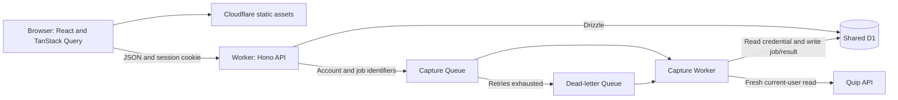

# Architecture

The implemented app connects Quip accounts, manages saved credentials and browser sessions, and captures a fresh current-user profile in the background. This document maps its runtime, component boundaries, and shared code patterns.

## Runtime

A client-rendered React/Vite SPA and a Hono API share a Cloudflare Worker deployment and browser origin. Cloudflare serves frontend assets with SPA fallback and sends `/api/*` requests to the API. A separate capture Worker consumes tasks from Cloudflare Queues. Both Workers share D1 for accounts, credentials, sessions, capture jobs, progress events and the latest captured profile.

[wrangler.jsonc](../wrangler.jsonc) defines the API, Queue producer and scheduled recovery of pending submissions. [wrangler.capture.jsonc](../wrangler.capture.jsonc) defines consumers for capture and dead-letter messages. [vite.config.ts](../vite.config.ts) runs both Workers and their local bindings together through Cloudflare's auxiliary-Worker support; builds emit each Worker separately.

## Component map

| Location | Responsibility |
| --- | --- |
| [src/app/](../src/app/) | React UI, with feature components and data hooks grouped together. |
| [src/app/api.ts](../src/app/api.ts) | Typed browser/server boundary and shared HTTP error handling. |
| [src/worker/index.ts](../src/worker/index.ts) | API assembly and shared response/error handling. |
| [src/worker/entry.ts](../src/worker/entry.ts) | API runtime entry point and scheduled submission recovery. |
| [src/worker/auth/](../src/worker/auth/) | Account and session behavior, persistence and credential protection. |
| [src/worker/capture/](../src/worker/capture/) | Capture API, Queue consumer and D1 job/progress/result persistence. |
| [src/worker/quip/](../src/worker/quip/) | External Quip API boundary and response validation. |
| [src/worker/db/schema.ts](../src/worker/db/schema.ts) | D1 schema; generated SQL and metadata live in [migrations/](../migrations/). |
| [tests/](../tests/) | Auth and capture integration tests using isolated Cloudflare runtimes and Quip fixtures. |

## Shared patterns

Feature hooks encapsulate data fetching and mutations with TanStack Query. React components handle presentation and transient interaction state. Server state stays in the Query cache; capture status polls while a job is active, and sign-out removes account-specific cached results.

The browser calls a same-origin JSON API through Hono's typed client. Request and response types are inferred from the server's chained route definitions and flow into frontend types. Thin HTTP handlers coordinate ordinary TypeScript modules that own persistence, cryptography, and external requests. Zod validates untrusted inputs at network boundaries; API errors expose safe messages.

Drizzle defines the D1 schema and provides typed queries. Related writes use atomic batches or foreign-key cascades. Authentication reads use the primary database so session revocation takes effect consistently. Drizzle Kit generates schema SQL, and Wrangler applies it.

## Background capture

D1 retains one row per capture, with a database constraint allowing only one active job per account; overlapping starts reuse that job. The API persists the job before sending its identifiers to the Queue; a scheduled handler recovers pending submissions after interruption. Duplicate sends are safe. Each delivery claims an expiring attempt lease in an atomic D1 update. Superseded and terminal messages do no source work; overlapping deliveries wait through Queue retries, and stale attempts cannot overwrite results.

The consumer obtains the saved credential from D1, decrypts it with its own Worker secret, and calls the shared Quip boundary for a fresh current-user read. Queues owns delivery retries. Invalid credentials fail immediately; exhausted deliveries go to a dead-letter consumer that records failure. Browser sessions are not involved in background execution.

Progress is an append-only stream tied to each job. Inserts check the owning attempt lease, and the authenticated API returns the newest job and its latest event for UI polling. The normalized profile, completion event and completed job status commit together in a D1 batch. The latest successful result remains available through the authenticated API even if a later capture fails. Job state carries identifiers, timestamps and safe errors, never a PAT or profile body. This small capture needs no blob storage; full archive discovery, rate-limit orchestration and packaging remain separate work.

## Identity and trust boundaries

Quip validates submitted personal access tokens and supplies the source identity. The API owns app authentication: it stores encrypted Quip credentials separately from browser sessions, which use opaque HttpOnly cookies and hashed tokens in D1. Credentials remain server-side and Queue messages contain only identifiers. The consumer has no public HTTP endpoint; its D1 binding and encryption secret provide the background execution boundary. Each Worker needs the same credential encryption key.

Starting and reading captures require an active account session; starts also enforce same-origin requests. Job creation checks the session inside the write. Sign-out revokes a browser session without stopping background capture. Credential replacement retains source identity. App-account deletion atomically cascades to credentials, sessions, capture jobs, progress events and results. Account and attempt checks inside result writes prevent late deliveries from recreating deleted data. A fresh sign-in after deletion gets a new internal account ID.

The [auth modules](../src/worker/auth/), [capture modules](../src/worker/capture/) and [Quip client](../src/worker/quip/client.ts) implement these boundaries. See [README.md](../README.md) for setup and operational workflows, and [the technical design](phase-1-design.md) for the remaining capture roadmap.
