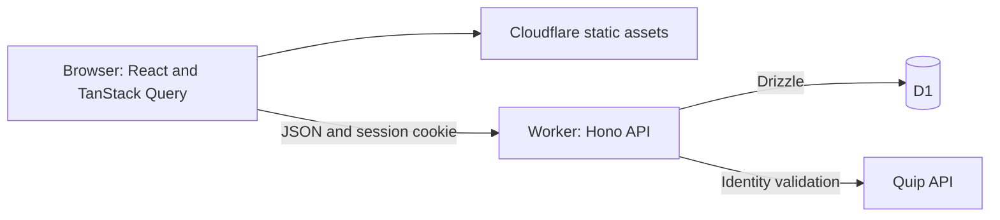

# Architecture

The implemented app connects Quip accounts and manages saved credentials and browser sessions. This document maps its runtime, component boundaries, and shared code patterns.

## Runtime

A client-rendered React/Vite SPA and a Hono API run on one Cloudflare Worker deployment, backed by a shared D1 database. The browser and API share an origin. Cloudflare serves frontend assets with SPA fallback and sends `/api/*` requests to the Worker.

[wrangler.jsonc](../wrangler.jsonc) defines deployment bindings and routing. [vite.config.ts](../vite.config.ts) integrates React with the Cloudflare plugin so local development and preview run the API in the Workers runtime.

## Component map

| Location | Responsibility |
| --- | --- |
| [src/app/](../src/app/) | React UI, with feature components and data hooks grouped together. |
| [src/app/api.ts](../src/app/api.ts) | Typed browser/server boundary and shared HTTP error handling. |
| [src/worker/index.ts](../src/worker/index.ts) | API assembly and shared response/error handling. |
| [src/worker/auth/](../src/worker/auth/) | Account and session behavior, including persistence and credential protection. |
| [src/worker/quip/](../src/worker/quip/) | External Quip API boundary and response validation. |
| [src/worker/db/schema.ts](../src/worker/db/schema.ts) | Database schema; generated SQL and metadata live in [migrations/](../migrations/). |
| [tests/](../tests/) | Integration tests using isolated local D1 storage and Quip fixtures. |

## Shared patterns

Feature hooks encapsulate data fetching and mutations with TanStack Query. React components handle presentation and transient interaction state, with shared components for repeated UI. Server state stays in the Query cache; mutations synchronize that cache with their results. These patterns apply throughout the frontend.

The browser calls a same-origin JSON API through Hono's typed client. Request and response types are inferred from the server's route definitions and flow into frontend types. Thin HTTP handlers coordinate ordinary TypeScript modules that own persistence, cryptography, and external requests. Zod validates untrusted inputs at network boundaries; API errors expose safe messages.

Drizzle defines the schema and provides typed queries over D1. Related writes use atomic batches or foreign-key cascades. Authentication reads use the primary database so session revocation takes effect consistently. Drizzle Kit generates schema SQL, and Wrangler applies it.

## Identity and trust boundaries

Quip validates submitted personal access tokens and supplies the source identity. The Worker owns app authentication: it stores encrypted Quip credentials separately from browser sessions, which use opaque HttpOnly cookies and hashed tokens in D1. Browser responses contain profile data, while credentials remain on the server. Mutations enforce same-origin requests, and secrets stay out of persistent browser storage and logs.

The app session is independent of the Quip credential after sign-in. Credential replacement must retain the same source identity; sign-out revokes a browser session, while app-account deletion removes its owned records without changing the Quip account. The [auth modules](../src/worker/auth/) contain these rules; the [Quip client](../src/worker/quip/client.ts) owns outbound credential use.

See [README.md](../README.md) for setup, commands, and operational workflows.
