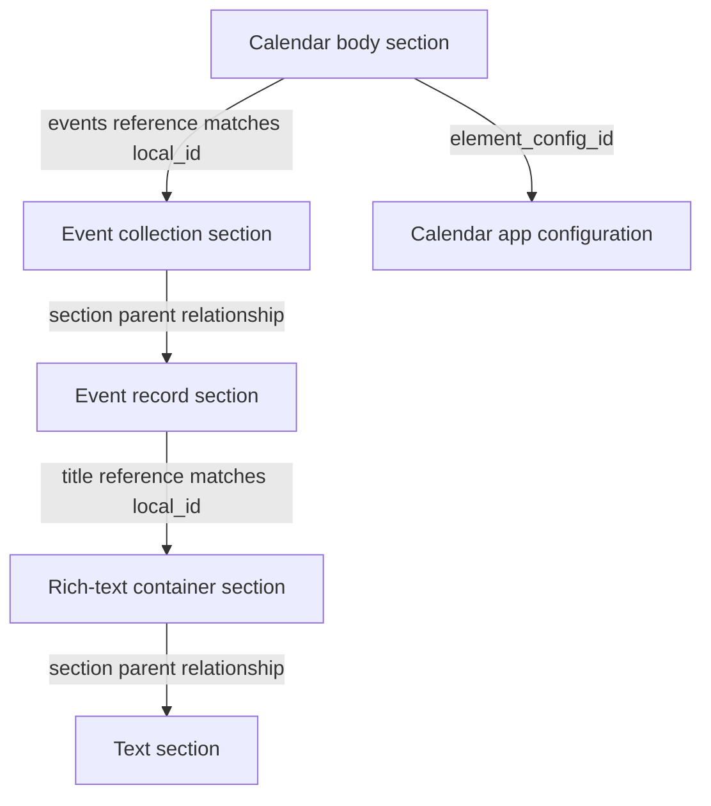

# Calendar model investigation

Observed September 23, 2026 through the user's authenticated Quip tab and in-product debugging tools. Fixture: [London February 2026 Sketching](https://quip.com/VtYCAiS9wab3/London-February-2026-Sketching). No document content was intentionally changed. The initial investigation was a targeted native-model inspection; the follow-up below adds a public API comparison. Neither is a complete export.

## What was inspected

The Model (with 10x) Browser exposed the document's `Section/` index, with entries numbered 0–217. These 218 entries cover the whole document, not just the Calendar. Expanded the Calendar body, event collection, selected event/rich-text/text sections, app configuration, document metadata and one Calendar edit message. Parsed the complete body payload shown by the inspector to count events and inspect its shape.

The debugging article describes the inspector as a protocol-buffer text-format view of model objects. That explains the display, but does not establish the desktop cache's serialization format. [Quip debugging tools article](https://quip.com/blog/how-quip-builds-inproduct-debugging-tools).

## Verified Calendar reference chain

The following IDs make the trace reproducible in this fixture. They are object identifiers, not credentials. Preserve them as opaque strings, including the `temp:C:` prefix; do not discard records because their IDs look temporary.

| Role | Observed section ID |
| --- | --- |
| Calendar body | `temp:C:aCM4ad734e2a1ac45a4b6945b6e3` |
| Event collection | `temp:C:aCMbfc99f1cd81c42209fc259780` |
| Sample event | `temp:C:aCMed4aafd7d7014094b4d8519f1` |
| Sample title container | `temp:C:aCMc6351692cbd04daba6aee044e` |
| Sample text | `temp:C:aCMa7d010a573bf40edbd9948b9c` |

The Calendar body's `json_data.events` is `{t: 2, v: <local ID>}`. That value matches the collection section's `element_child.local_id`, not its Quip section ID. The collection has `element_child.type: 3` and `json_data` containing `itemConstructorKey: "project-calendar-event"` and `itemRecordType: 0`, each inside a `{t, v}` wrapper.

The sample event has `element_child.type: 0`, `record_constructor_key: "project-calendar-event"`, a separate `local_id`, and parent linkage to the collection. Its JSON fields are `dateRange`, `color`, `title` and `created`. The `title` value has `t: 1` and matches the title container's local ID. That container has `element_child.type: 1`, placeholder metadata and a parent pointing to the event. The text section has that rich-text container as its parent and the Calendar body as `container_id`.

Thus, at least two kinds of references need resolving: Quip section IDs in the structural graph and Live App local IDs within serialized JSON. Scope local-ID resolution to the containing app instance unless broader uniqueness is verified. The observed `t` and `type` numbers should be preserved, not generalized into a full enum specification from this one fixture.

The sample text is “Travel Day.” Its event is red and has start/end values of `2026,1,21` in the native record. The corresponding payload entry has `2026-02-21`. A second event record similarly uses `2026,1,15` where the payload uses February 15. This is consistent with a zero-based native month; preserve the original and test conversion on additional months before making that a general decoding rule.

## Two materially different representations

The body contains both `json_data` and `payload`.

`json_data` includes a timezone-bearing `displayMonth` string and a reference to the event collection. Its contents alone are not a standalone list of event text: following referenced sections is necessary.

The complete `payload` parses as an object with:

- `displayMonth: "2026-02"`.
- 18 events spanning February 15–21, 2026.
- Exactly three keys per observed event: `color`, `dateRange`, `content`.
- Equal start/end dates for all events in this fixture.
- Text content, including clock times as text; no separate structured clock-time field.

The payload does not include the event record's local ID, section IDs, creation metadata or parent graph. The sample native text matches the payload text apart from the latter's trailing newline.

**Inference from the fixture:** the payload is a flattened representation of the richer records. Subsequent documentation research identifies the public `quip.apps.setPayload` contract: an app-supplied string is stored and exposed in HTML exports as `data-live-app-payload`. This explains the export mechanism, but not Calendar's specific generation code, refresh timing or possible staleness. [SDK contract](https://quip.com/dev/liveapps/1.x.x/reference/global-actions/setting-payload/). A renderer/export payload is therefore useful but insufficient for preserving all native identity and structure. Store it alongside the original section graph when that graph is available.

## Configuration and version metadata

The referenced `syncer.ElementConfig` identifies Calendar version `1.2.14`, with `version_number: 20`. The body has `json_data_version: 20`, `created_version: 20`, and `data_version: 0`. The matching 20 values are an observation, not proof that all version fields have the same meaning.

The configuration also exposes sizing, icon, permission/capability and display metadata. Preserve a source snapshot when available so an importer knows which app/version produced the captured records; avoid relying on a globally hardcoded Calendar configuration ID.

The `syncer.Document` record separately includes `active_version`, `max_section_sequence`, `has_10x_format: true`, and `section_edit_history_complete: true`. That flag is not proof that this browser has downloaded all historical section versions, nor that the archive has captured them.

## Calendar edits are linked to document history

Inspected message `aCMADA1cbZJ`, a visible Calendar title edit. Its native `syncer.Message` contains:

- `diff_groups` with an RTML insertion and a `section_id`.
- `version_before` and `version_after`.
- `sequence_before` and `sequence_after`.
- `document_id`, `thread_id`, `edited_section_ids`, author/time and client-origin metadata.

Following the diff's section reference opens a `TEXT_TYPE` section whose `container_id` is the Calendar body. Its current text contains later edits as expected: a reference from an old edit resolves to the current section, not automatically to the section at the historical version.

**Consequence:** Calendar title edits can be represented in the normal document edit stream. Capture ordinary edit messages even when a document contains a Live App. If native acquisition is added, preserve version/sequence links and distinguish current section resolution from historical snapshots. This observation does not prove that event date/color changes, every Live App operation, or every prior version are covered by that stream.

## Initial UI export attempt

The document's Export menu offers PDF, Microsoft Word, HTML, Markdown, and Microsoft Word with Comments. Selecting HTML displayed “Preparing to Export,” followed by a frame reporting that Chrome blocked the page. No matching downloaded file was found in the normal Downloads directory. No browser protection was bypassed; the actual HTML export content was not obtained or compared.

During that initial inspection, no personal API token was used and no live LevelDB was opened. External `quip.tools` lookup/history links were not needed; all native records above came from Quip's already-enabled inspector.

## Official API follow-up

The user subsequently supplied a personal API token. Its HTML endpoint succeeded and exposed the Calendar payload plus 18 event rows. All 18 rows match the payload one-to-one by whitespace-normalized text, color, start date and end date. Each row supplies an event section ID via `data-live-app-section-id`; the containing element supplies app and body identity. Preserve the custom attributes, not just visible table content.

The API edit stream returned 11 messages, including the native title-edit message described above. It retains the section-targeted RTML diff but omits the native version/sequence bounds. Ordinary messages returned an empty list. See [API research](api-research.md) for response structure, pagination and wider account findings.

This improves the API-only baseline materially: Calendar event content and event identities are available. It does not establish capture of the native local-ID reference graph, all version metadata, record creation dates or every operation's history. Nor does comparing HTML rows with the embedded payload independently verify payload freshness against all native records.

Remaining evidence to obtain:

1. A complete comparison of all 18 events with native records and rendered cards; the native investigation traced selected records.
2. A fixture containing multi-day events, rich title formatting, links/mentions, comments and deleted events.
3. Native history of a date/color change and a deleted event, to establish where title diffs stop being sufficient.
4. Payload generation and refresh behavior.
5. A consistent desktop-cache snapshot to determine which inspected records and version history are persisted locally.

These are research tasks, not questions the user must answer from memory.
