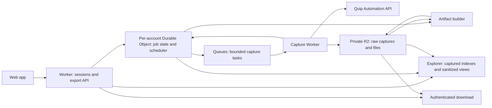

# Quip archive: phase 1 technical design

Status: discussion draft, reorganized September 30, 2026. The [phase 1 PRD](phase-1-prd.md) owns product scope, user experience, requirements and release acceptance. This document covers implementation and technical validation. Research was performed September 23, 2026: authenticated UI/model inspection and targeted read-only REST probes support the proposal, but no desktop-cache decoding or full account export has been performed. See [API research](api-research.md), [Calendar model research](calendar-model-research.md) and [prior art](prior-art.md). Items labeled **validate** require experiments before implementation commitments.

## 1. Design overview

Implement the PRD's hosted, resumable capture using the official Automation API first, with a portable SQLite-plus-files ZIP and hosted captured-data explorer. Prefer Workers-only hosting. Separate source acquisition, immutable observations, normalization and derived rendering so later desktop-cache or internal-web-API adapters can fill fidelity gaps without replacing the archive format. Destination importers remain phase 2 work.

Adopt the capture-before-rendering pattern and resolve source links to captured content in hosted previews. Existing code also supplies concrete regression cases: omitted roots, single-page comments, three-page HTML truncation, and timestamp pagination that stops without proving completeness.

## 2. Official API capture plan

This table is a proposed acquisition checklist based on the current specification. “Capture” means retain the returned representation; it does not assert that the representation is a lossless model of the Quip UI. Technical field names and endpoint contracts were checked against the [current OpenAPI specification](https://quip.com/dev/automation/documentation/current/openapi-specs) after Context7 results revealed older examples.

| Surface | Proposed acquisition | Fidelity to validate |
| --- | --- | --- |
| Account and people | Current user, referenced users, available contacts and member records | Missing/deactivated identities; avoid inferring unavailable identities |
| Folder organization | Root folders, children, parent and link relationships, thread-folder membership, available sharing settings | Shortcuts, multiple placements, ordering, inaccessible children, empty folders |
| Documents, checklists, tables | Raw thread metadata and every HTML page; DOCX as an additional representation | Checked state, formatting, mentions, section IDs, embeds, source-specific semantics |
| Spreadsheets, including embedded sheets | HTML, spreadsheet feature summary, XLSX | Formulas and cached values, charts, validation, conditional formats, filters, references, hidden/frozen cells |
| Chats and document conversations | All available ordinary-message pages, raw rich parts and metadata | Inline anchors, reply grouping, resolved/deleted state, attachment mapping |
| Reactions | Returned reaction records alongside message snapshots | Emoji/user completeness and mutation during capture |
| Edit history | Separate edit-message traversal; preserve complete diff payloads and RTML | History depth, grouping, omitted edits, reversibility and reconstruction |
| Images, attachments, historical media | Extract references from all captured representations and fetch source blobs | Unreferenced blobs, original versus thumbnail, media referenced only by deleted content |
| Slides | Metadata and available PDF export, plus conversation/edit streams | Editable slide structure and embedded resources |
| Live Apps | Preserve all exposed HTML, identifiers, payload attributes, messages, and files; prioritize Calendar interpretation | Calendar record completeness first; other first-party apps as selected; opaque preservation for arbitrary apps |
| Trash/archive and inaccessible items | Discover available roots and metadata; preserve readable data and failure records | Archive is not deletion; visibility/removal flags do not prove permanent deletion |

### Endpoint inventory

Paths are relative to the verified Quip API origin. Record exact API version, parameters and observation time for every response.

| Purpose | Endpoint / key settings |
| --- | --- |
| Identity and root folders | `GET /1/users/current` |
| Folder traversal | `GET /1/folders/{id}`, `include_chats=true` |
| Membership-based thread enumeration | `GET /1/users/current/threads`, `threads_meta=true`; inspect `include_deleted` semantics |
| Broader visible-thread discovery | `GET /1/users/current/threads-modified-after-usec`, `required_access_level=1`, `include_ofbwg=true`; epoch zero accepted in the personal-account probe |
| Supplemental discovery | `GET /1/threads/recent`, `include_hidden=true`; explicit user-provided URLs |
| Thread metadata | `GET /2/threads/{threadIdOrSecretPath}`; bulk variant where useful |
| Body | `GET /2/threads/{threadIdOrSecretPath}/html`, traverse all cursors |
| Organization and sharing | V2 thread `/folders`, `/members`, `/invited-members`; folder link-sharing settings |
| Conversations | `GET /1/messages/{thread_id}`, `message_type=message`, `count=100` |
| Edit messages | Same endpoint with `message_type=edit`, separately checkpointed |
| Blob bytes | `GET /1/blob/{thread_id}/{blob_id}` |
| Native export files | `GET /1/threads/{thread_id}/export/docx` and `/export/xlsx` |
| Bulk native exports | `POST /1/threads/export/async`, then poll matching GET; request conversations where supported |
| PDFs | Async `/1/threads/{thread_id}/export/pdf/async`; slide PDF uses the direct export endpoint |

Current contracts include `diff_groups` in edit messages, reaction data, and Live App message source identifiers. They also distinguish the ordinary thread list from open-workgroup visibility. An exporter should explicitly request both message streams and multiple discovery paths. [Message reference](https://quip.com/dev/automation/documentation/current#operation/getRecentMessages), [thread discovery reference](https://quip.com/dev/automation/documentation/current#operation/getCurrentUserThreadsModifiedAfterUsec).

### Discovery and pagination correctness

Start from every returned root, including archive, private, starred, shared, group and trash roots when present. Traverse children using a visited set. Combine that result with both user-thread endpoints and supplemental discovery; record which source found each object. Resolve secret URLs to permanent IDs. Fetch thread-folder relationships to discover additional placements and folders. Scope exclusions must also apply to objects found through another discovery path.

Store a graph. A thread can occur in several folders; collapsing it to a single filesystem path would lose information. Preserve containment, permission-parent relationships and shortcuts as distinct edge types. Titles are labels, never primary keys or unique filenames.

The directly fetched current spec caps the two user-thread listing methods at 100 results and describes cursor expiry after 30 minutes. Older indexed examples say 1,000. Drain discovery pages promptly, persist observations, and restart/deduplicate enumeration if a cursor expires. V2 HTML and membership responses also need cursor traversal. Folder retrieval has no pagination parameters in the inspected current contract; large-folder completeness needs a fixture test.

Messages use timestamp pagination rather than an ID cursor. Test the inclusive `max_created_usec` boundary, overlap pages, and deduplicate by source message ID. Do not blindly subtract one microsecond: a full page of messages at a single boundary timestamp could otherwise be skipped. If the API cannot advance without ambiguity, record a coverage gap and keep the response. Conflicting update-filter descriptions in the documentation are another reason to use a tested full traversal for the first release.

“No more results” proves exhaustion of that endpoint under that credential and scope, not that Quip contains no other data. Known UI items absent from discovery can be seeded by URL and listed in the coverage report.

### Representations and history

Capture raw response bodies before interpretation, plus a normalized index. Save every HTML page separately with its cursor/order; only produce a combined body after establishing how page boundaries work. Use fixtures of at least three HTML pages: source review found an exporter that retrieves all pages but loses earlier content during recursive assembly. Unknown fields and unknown content types survive capture even when normalization fails.

Prefer XLSX for spreadsheet semantics and HTML for section identity; retain both. A document containing sheets needs its document representation and spreadsheet export. Request DOCX for text documents where available. Treat PDF as supplementary visual evidence, particularly for slides or problematic content; it is not the primary structured archive. Bulk export availability and format/conversation behavior must be probed on real accounts.

Capture edit messages as source history, not as an invented revision system. The archive may later support replay, but no claim of reconstructing every past state is made until verified against Quip. Preserve anchors even if their target section no longer exists. Do not infer a reply parent solely from a shared annotation ID.

Extract file references from current HTML, rich messages, edit diffs, and exposed app payloads. Preserve bytes, MIME type, original filename, source identifier and checksum. A signed URL is a retrieval mechanism, not an archive. External embeds get their source reference and any returned snapshot; recursively downloading arbitrary linked websites is out of scope.

### Calendar Live App fixture

The user nominated [London February 2026 Sketching](https://quip.com/VtYCAiS9wab3/London-February-2026-Sketching) as a real Calendar fixture and supplied screenshots plus an authenticated tab with debugging enabled. Read-only inspection recovered the displayed Calendar payload, traced a native event through its collection/title/text sections, and linked a Calendar edit message to its current text section. Official API HTML now confirms 18 events, their dates/text/colors and rendered event section IDs; API edit messages include the inspected title diff. See [Calendar model investigation](calendar-model-research.md) and [API research](api-research.md). Desktop-cache contents remain untested.

Observed model details:

| Screenshot and live-inspection evidence | Capture implication |
| --- | --- |
| The overlay distinguishes thread ID, document ID and a document section collection | Preserve these identities and their mappings separately; do not equate the public URL identifier with all of them |
| The Calendar body appears as `syncer.Section` with `ELEMENT_BODY_TYPE` / `ELEMENT_BODY_STYLE` | Model the app's containing section as an entity, not only an HTML placeholder |
| Section fields include `id`, `sequence`, `deleted`, `position`, `section_class`, `parents` and layout attributes | Preserve raw values and explicit parent edges; do not treat sequence as a timestamp or replayable revision without verifying its semantics |
| `content.element_body` includes `element_config_id`, `local_id`, `json_data`, `payload`, `data_version`, `json_data_version`, `created_version` and `creation_usec` | Preserve configuration references, both serialized data strings, and each version field independently |
| Body `json_data` contains `displayMonth` and an `events` reference matching a child collection's `local_id` | Preserve the exact representation and resolve Live App local IDs separately from section IDs |
| The full `payload` contains 18 events, each with `color`, `dateRange`, and `content`, plus a top-level `displayMonth` | Useful standalone event content; it omits native record identities, graph relationships and creation metadata |
| A native event points to a rich-text container by local ID, which parents a text section; all are associated with the Calendar body | Preserve collection, record, rich-text and text sections with their references; do not reduce each event to its text |
| Native date strings use `2026,1,21` where the matching payload uses `2026-02-21` | Preserve both encodings; verify zero-based month conversion before normalizing |
| A Calendar title edit has normal `diff_groups`, plus native before/after version IDs and sequence bounds | Capture edit streams for Live Apps, and preserve extra native history metadata when obtainable |

Three representations are now observed: native section records, the inspector's flattened Calendar payload, and public API HTML. The API HTML embeds an 18-event payload and 18 rows, with a one-to-one match for normalized text, color, start date and end date. The rows add event section IDs missing from the payload itself. The native body's `json_data`, local-ID graph, creation metadata and app-version fields are not exposed as native records by this HTML result. Preserve the entire HTML, custom attributes and payload before rendering.

Eleven edit messages were returned for the fixture, including the exact title-edit message inspected in the native debugger. Its API representation includes the section-targeted RTML diff but omits native before/after version IDs and sequence bounds. Ordinary-message capture returned an empty list. These results support useful Calendar preservation through the official API, without claiming native graph or full revision-history fidelity.

The SDK's documented `setPayload` mechanism supplies the string emitted as `data-live-app-payload`; Quip's 2020 release notes explicitly include Calendar in Live App HTML export. This is an app-defined export representation, not an implicit dump of native records. Calendar-specific payload generation and refresh behavior remain unverified. [Payload contract](https://quip.com/dev/liveapps/1.x.x/reference/global-actions/setting-payload/), [release notes](https://quip.com/release-notes/2020-11-17).

Remaining Calendar experiments: compare every native event record, test multi-day events, rich titles/mentions/files, deletion, non-text date/color history and payload freshness. Clock times in this fixture are event text, not independent structured timestamps. The earlier blocked UI HTML download is no longer the obstacle to API comparison; API HTML was obtained successfully.

## 3. Authentication and access feasibility

**Personal tokens are the v1 connection path.** The supplied token successfully accessed identity, folders, broad thread discovery, HTML, ordinary/edit messages, XLSX and a blob. This establishes feasibility for the initial personal account, not every plan or Quip site. Validate each user's capabilities after connection and report unavailable endpoints explicitly. [Authentication reference](https://quip.com/dev/automation/documentation/current#section/Authentication).

Validate submitted PATs server-side against `/1/users/current`. Never put credentials in URLs or browser persistent storage. Persist the source identity independently of the credential and reject replacements for a different account. Export-generation POST requests are permitted because they create export jobs without changing source content.

Document token creation and replacement; current documentation says generating a new personal token invalidates earlier ones. Do not generate or rotate tokens automatically. Encrypt the submitted token at rest, redact it from telemetry, and use it only against the verified Quip API origin. Replacement must resolve to the same account. App behavior is read-only even if the supplied PAT has broader permissions.

OAuth is optional future onboarding, not a release gate. Before adding it, validate public-client registration across account types, actual scopes, redirect/state behavior and any PKCE support. Do not expose a shared client secret based on the generated documentation's browser-facing query schema. Use least-privilege read scope where supported, including testing export-generation POST permissions.

Keep OAuth, personal-token and future session credentials behind separate adapters. Credentials, Cookie/Authorization headers, refresh tokens, and reusable signed-download credentials must never appear in the downloadable archive or logs. If a content response embeds authentication material, redact that material with a recorded redaction; do not falsely describe the result as byte-identical.

App access must survive token expiry and eventual Quip shutdown for the short remaining artifact lifetime. Propose an independent opaque recovery credential, delivered at creation, with a normal secure browser session. Losing that credential may require reconnecting while Quip is still available. Decide whether email/account recovery is worth adding before public launch.

## 4. Download format

**Confirmed format: one portable ZIP containing SQLite and content-addressed files.** The operational database and the downloadable database need not be the same physical database.

```text
quip-archive-<id>/
  README.md
  manifest.json
  archive.sqlite
  objects/sha256/<prefix>/<hash>
  coverage.json
  checksums.sha256
```

`archive.sqlite` contains normalized entities, observations, relationships, capture results and references to raw JSON/HTML/export files. Large bodies and binaries live under `objects/`; the relative path and digest are sufficient to resolve them offline. One object can have multiple source references. Deduplicate within an archive, never expose cross-user deduplication as an information channel.

Deliver as a standard ZIP64 bundle, with separate downloads or volumes available if practical browser/file limits require them. SQLite alone is an index download and must be labeled as such; it is not the complete archive. A future all-in-one SQLite BLOB packing option can reuse the format, but is not necessary for v1. Retaining a single huge BLOB database would make the normal artifact harder to package and inspect.

The manifest records schema version, exporter build, source account/origin, selected scope, capture interval, source-adapter versions, counts, gaps, redactions and object hashes. Files use stable IDs/hashes, not user titles. Never require hosted URLs to resolve archive content.

### Proposed logical schema

| Tables | Purpose |
| --- | --- |
| `archive_info`, `capture_runs`, `sources` | Schema/build, identity, scope and collection interval |
| `requests`, `objects` | Sanitized request metadata, response status, source/body hash, size, MIME type and local object path |
| `entities`, `entity_observations` | Stable typed IDs and append-only captured representations |
| `threads`, `folders`, `users` | Convenient normalized records derived from observations |
| `relationships`, `relationship_observations` | Folder placement, membership, sharing, shortcuts, ordering when available |
| `messages`, `message_observations` | Both message streams, authors, times, rich content, annotations and reactions |
| `edit_groups`, `edits` | Source edit grouping, section identifiers, diff type and raw payload references; optional native before/after version IDs and sequence bounds |
| `document_representations`, `sections`, `section_observations` | HTML pages, native exports, document/section identity, native records when available, opaque position/sequence/version fields and capture provenance; section-parent edges use `relationships` |
| `link_references`, `source_aliases` | Original URL/alias, resolved thread/folder/section, source observation and resolution status; generated preview targets are derived separately |
| `blob_references`, `live_app_instances` | Source identifiers linked to saved objects; containing section, configuration and local identifiers; separate raw `json_data` and `payload` representations when exposed |
| `coverage`, `failures` | Result per item and feature, reason, retryability and evidence |

Source IDs are opaque strings, namespaced by origin/account and entity kind. Preserve source timestamps as exact microsecond values and observation timestamps separately. Do not convert them to millisecond dates or coerce IDs into numbers. Every derived row points back to an observation; reparsing can improve normalization without another Quip export. Record cross-document and section links before rewriting them in previews; retain original URLs and mark excluded/inaccessible/unknown targets explicitly. Resolving a link must not bypass scope exclusions.

Suggested per-feature states: `captured`, `partial`, `unsupported`, `inaccessible`, `failed`, `excluded`, `not_applicable`, `unknown`. “Captured” is scoped to a specific representation. A separate verification field records whether fidelity has been fixture-tested or manually compared. Unknown must never collapse into empty.

## 5. Explorer implementation

The [PRD](phase-1-prd.md#archive-explorer-required-in-v1) defines the required views and user-visible behavior. Hosted views must derive from the same saved observations used to build the bundle; browsing must not make fresh Quip requests.

Preserve every HTML occurrence of a section reference. This fixture contains repeated HTML IDs, and event IDs can be in `data-live-app-section-id` rather than `id`. A source section can map to multiple rendered nodes; inferred HTML structure must not masquerade as a captured native section graph.

Keep expensive search indexes separate from the portable archival core. Low-level exploration uses typed read endpoints; unrestricted SQL against the live operational database is out of scope. Advanced users can query the downloaded SQLite themselves.

Preview rendering uses an isolated origin or sandboxed iframe, sanitization and restrictive CSP, with scripts, forms, active embeds and automatic remote loads disabled. Rewrite images/attachments to authorized captured-object routes and mark missing files. Keep the original response separately; sanitization must not overwrite it. Escape source markup in inspector/diff views.

Failure to render one feature must preserve its raw content and visibly report the limitation. Test hosted browsing with the Quip credential removed.

## 6. Cloudflare architecture



Proposed implementation is TypeScript for the web/backend capture layer, with a small runtime-neutral acquisition/normalization core. Choose the UI framework when implementation starts; it does not determine archival fidelity.

Use one SQLite-backed Durable Object per source account for work scheduling, leases, compact normalized explorer indexes, credential replacement coordination and user-level rate limiting. Add company-level coordination when multiple hosted users share a company limit. Use R2 for raw bodies, files and final artifacts. A small shared D1 database is optional for app-session/export lookup; it should not hold every document body.

Queues deliver bounded jobs; the persisted task ledger is authoritative. Workflows are an alternative for phase orchestration, not an additional requirement in v1. Avoid one enormous workflow with a step per record.

### Workers-only packaging

Containers are **not required for streaming ZIPs**. The earlier recommendation simplified portable SQLite assembly by providing conventional writable disk, native SQLite and more resource headroom. The design now uses Workers-only hosting as the baseline, with a packaging spike to establish supported index sizes before launch.

Separate two jobs:

1. **Build the SQLite index.** Freeze an immutable capture manifest and produce `archive.sqlite` from bounded batches of normalized records. Keep raw HTML, large JSON/RTML bodies, exports and attachments in R2 objects rather than duplicating all content in SQLite. Test a Worker-compatible SQLite WASM build for this relatively compact index. Validate integrity and references, upload the result, then release its memory before ZIP assembly. Restart this bounded build from its immutable inputs after failure; capture does not need to restart.
2. **Stream the bundle.** Package the verified SQLite file and captured objects into a ZIP64 stream stored through R2 multipart upload. Bound buffering and persist the upload ID, completed part ETags, output/source offsets, entry CRC state and central-directory metadata. Use stored entries initially to avoid having to checkpoint compression state. Do not hold the complete ZIP or its central directory in memory. Publish the download only after multipart completion and manifest validation. [R2 multipart API](https://developers.cloudflare.com/r2/api/workers/workers-multipart-usage/).

The important limit is index assembly size, not total attachment size. Workers have 128 MB per isolate including WASM; concurrent builds can share that limit. Temporary `node:fs` files are memory-backed and do not provide disk spill. `node:sqlite` is currently listed as a non-functional stub. [Workers limits](https://developers.cloudflare.com/workers/platform/limits/), [temporary filesystem](https://developers.cloudflare.com/workers/runtime-apis/nodejs/fs/), [Node compatibility](https://developers.cloudflare.com/workers/runtime-apis/nodejs/).

SQLite WASM's convenience export serializes the database into a complete `Uint8Array`. Peak memory includes the database, serialization allocations, JS objects and runtime overhead; a database smaller than 128 MB is not automatically safe. Choose the WASM runtime, export method, memory budget and concurrency bound through an actual Worker deployment test. [SQLite WASM serialization](https://sqlite.org/wasm/doc/trunk/api-c-style.md#sqlite3_js_db_export).

| Storage/assembly choice | Decision |
| --- | --- |
| SQLite-backed Durable Object | Use for the live job ledger and explorer indexes. Its managed database is not an ordinary downloadable file; no binary export is assumed. |
| Per-user D1 | No need for v1. Modern D1 export is SQL; binary `dump()` only applies to old alpha databases. It does not remove the assembly step. |
| Worker WASM builder | Preferred first implementation for a measured, bounded portable index. The account's desktop-cache size does not predict this index's size. |
| Browser SQLite with OPFS | Candidate fallback for indexes beyond the Worker budget, keeping hosting Workers-only. Requires a browser Web Worker, sufficient storage and a packaging tab; this is separate from unattended hosted capture. Validate resumable construction and streaming file extraction, rather than using a whole-file serialization helper. |
| Custom page-backed VFS / Container | Future alternatives if measurements justify them. Neither is a v1 dependency; a custom VFS adds substantial complexity. |

[Durable Object storage](https://developers.cloudflare.com/durable-objects/api/sqlite-storage-api/), [D1 export](https://developers.cloudflare.com/d1/best-practices/import-export-data/), [D1 binary-dump caveat](https://developers.cloudflare.com/d1/worker-api/d1-database/), [SQLite browser persistence](https://sqlite.org/wasm/doc/trunk/persistence.md).

**Packaging gate:** test representative and adversarial indexes, many small files, a multi-gigabyte streamed blob set, interruption at each multipart boundary, deterministic retry, ZIP64 interoperability and SQLite integrity. Measure peak memory and CPU in the hosted runtime, including concurrent work. Set the v1 size limit from these results, not the 202 MB desktop cache. Above the verified limit, retain captures and explain the packaging limitation with a raw recovery download; do not silently omit rows or label a SQL dump as SQLite. A supported large-index fallback is required before advertising unbounded account sizes.

## 7. Reliability, consistency and cost

Queue messages identify tasks; they do not contain credentials or large content. Use deterministic task identities, leases with fencing, a durable outbox, and idempotent commits. Store response bytes successfully before marking a task complete or advancing its cursor. Recover expired leases and unpublished outbox entries after crashes. Retried tasks may repeat source requests but must not erase previous observations. Quip export-job submission may itself be duplicated after an uncertain response; track this and bound retries rather than assuming remote exactly-once behavior. [Queue delivery guarantees](https://developers.cloudflare.com/queues/reference/delivery-guarantees/).

Quip documents rate limiting with HTTP 503, and inspected exporters already handle that case. Classify throttling using response details/reset headers, distinguish ordinary service failures, and handle 429 as well. Do not rely on HTTP 429 alone. Include a 503-with-reset fixture without deliberately exhausting a real account quota.

Handle rate limits with persisted `not_before` times and alarms; do not burn retries while waiting for an hour boundary. Back off with jitter on transient failures. Pause for expired credentials, record per-item access failures, and distinguish job-wide authentication failure from one inaccessible thread. A poison item must not prevent delivery of the rest of the archive.

The specification publishes defaults of 50 requests/minute and 750/hour per user, plus 600/minute per company; bulk exports have a separate document quota. The personal-account probes instead reported a user limit of 1,000 on a minute-reset header and a company limit of 600. This does not prove an hourly limit is absent. Use returned headers and observed behavior rather than hardcoded throughput assumptions. An illustrative 60,000-call export has an 80-hour lower bound at 750 calls/hour, before retries and generation delays. Long-running resumability is essential. [Quip rate limits](https://quip.com/dev/automation/documentation/current#section/Rate-Limits).

The account is not captured atomically. Record the whole capture interval and each representation's observation time. Sample metadata before/after a thread capture, flag changes and allow a bounded reconciliation pass. If activity never settles, finish with explicit mixed-time observations rather than loop indefinitely. The current thread schema says reactions and removal from folders do not always advance `updated_usec`; a final reconciliation therefore also revisits relevant relationships/message reactions, subject to an explicit request budget. This is part of completing one export, not a recurring-sync feature.

Define completion as a drained task ledger with terminal per-feature outcomes, closed discovery passes and a verified artifact. “Completed with gaps” is a valid result; an unsupported app or inaccessible item must remain visible.

Estimate costs from actual requests, R2 operations, captured bytes, final bundle duplication, retention days and packaging runtime. Report pilot measurements before setting public limits. Stream downloads from R2; do not allocate a packager while waiting for source rate limits. Add per-run storage/time budgets and global concurrency caps; reaching a cap pauses with a partial download available. [R2 pricing](https://developers.cloudflare.com/r2/pricing/).

## 8. Privacy and content handling

Hosted capture necessarily gives the service access to document content; do not imply end-to-end encryption. Use private storage, tenant-scoped authorization on every operation, encrypted credentials, secure app sessions and short-lived downloads. Logs contain counts, timings and error categories rather than titles, message text, cookies or tokens. Serve source HTML as a download or through a sanitized, isolated preview with scripts and automatic remote loads disabled.

Validate Quip origins and redirect targets before authenticated fetches; never forward OAuth tokens or cookies to arbitrary URLs found in content. Resolve blob references through the approved source adapter. This also prevents the exporter from becoming a general server-side URL fetcher. Keep original link text/identity while removing reusable signed credential parameters from exported request metadata, with redactions documented.

Deletion must fence running jobs before removing data so late queue deliveries cannot recreate a deleted archive. Lifecycle expiry is a backstop, not the only deletion mechanism. Verify cleanup of derived files and partial uploads as well as the obvious ZIP.

## 9. Later phase 1 acquisition sources

### Desktop cache

A directory-only inspection of the initial account's desktop LevelDB measured approximately 202 MB allocated on disk, not logical content or total account size.

The available LevelDB is a valuable candidate for native structures, discovery comparison, and data omitted from official API outputs. Its actual coverage and encoding are unknown. A cache might contain only opened/synchronized items or historical remnants; neither presence nor absence proves current server state.

First preserve a consistent directory snapshot. Prefer copying after Quip has cleanly exited, or an explicitly consistent filesystem snapshot. Keep table files, logs, CURRENT and MANIFEST together. Preserve a checksummed untouched copy, and parse a working copy. Do not open, repair or compact the live app database with another library. LevelDB permits one opening process and its manifest tracks the active table set. [LevelDB concurrency and snapshots](https://github.com/google/leveldb/blob/main/doc/index.md), [file organization](https://github.com/google/leveldb/blob/main/doc/impl.md).

A future public flow could accept an explicitly selected cache snapshot or a locally decoded package. It cannot silently read the user's application directory from a website. Inspect potential credentials before upload and exclude them from the portable content archive. Preserve conflicting observations with source provenance rather than overwriting current API data with stale cache values. Cache analysis remains a research follow-up, not a prerequisite for the official-API release.

### Session-backed web capture

Reserve a source adapter for internal Quip requests. Explicit connection should verify the session belongs to the same source identity, record the Quip host and capture capabilities, and stop when the session expires. Cookie authentication may also require CSRF material or other session state; a cookie alone is not assumed sufficient.

A concrete prior-art lead is `wusuopu/QuipNoteExporter`, whose client uses a session cookie for `https://quip.com/-/{format}/{document_id}?download=1` (XLSX/PDF in its export flow). This route was source-inspected but not invoked here. Compare it with official exports where gaps are known; do not assume it returns raw models or edit history. [Source function](https://github.com/wusuopu/QuipNoteExporter/blob/679ab31dd205ba9b808ec8e0633ed18f4a8be784/app/quip.py#L800).

Investigate endpoint behavior using the user's own sessions after the API baseline identifies specific gaps. A normal cross-origin website cannot directly inherit Quip's logged-in cookies. A hosted cookie submission, browser extension, or local bridge are possible later transports. Prefer the smallest effective credential set and a short lifetime; never include it in the archive. Internal responses and cache records use the same observations/objects/coverage model. Do not design a second incompatible archive.

## 10. Validation and delivery plan

**Milestone A — feasibility and fixtures.** Personal-token access, initial inventory and representative content probes are complete; broaden coverage across account types and missing fixtures. OAuth registration/distribution is deferred. Build a manually inventoried test set covering old documents, nested/multi-placement folders, view-only and open-folder shares, archived/trash items, chats, resolved comments, reactions, dense edit history, inline media, attached files, embedded sheets and several Live Apps. The visible listing returned 885 threads and root traversal 68 folders; determine full blob/history volume during the pilot. Compare current API responses with the UI; preserve approved fixtures outside the public repository when they contain personal data.

**Milestone B — preservation core.** Capture raw responses and blobs, traverse all pages and both message types, track provenance, and produce a SQLite bundle plus coverage report. Add the folder/document explorer and low-level inspector over captured data. Keep normalization replayable. Test timestamp ties, repeated full pages, at least three HTML pages, separate paginated comment/edit streams, message-only attachments, duplicate titles, unresolved anchors, expired cursors, permission errors, unknown payload fields and source mutation during capture. Verify that bundle object references resolve to local files without hosted services.

**Milestone C — hosted resumability.** Add the Cloudflare coordinator and queue execution, secure connection/recovery, cancellation, progress, partial download and retention cleanup. Demonstrate crash/retry recovery, token replacement, duplicate delivery and deletion fencing. Complete Workers-only SQLite assembly and resumable ZIP64 packaging spikes before committing to public size limits; validate browsing without source credentials.

**Milestone D — account pilot.** Run the ten-year account, compare inventories and representative content with Quip, verify hashes, SQLite integrity and local object references, and measure throughput/cost. Confirm that no credentials appear in logs or downloads. Publish the precise supported-feature matrix and known gaps.

**Milestone E — deeper phase 1 research.** Compare the desktop cache with API coverage, then investigate internal web endpoints for proven gaps. Preserve new source data before implementing destination imports.

Release outcomes are defined in the [PRD acceptance criteria](phase-1-prd.md#4-release-acceptance). The milestones above establish the technical evidence for those outcomes.

## 11. Remaining engineering research

Confirmed requirements and proposed product defaults are maintained in the [PRD](phase-1-prd.md). Remaining engineering evidence:

1. Establish Worker SQLite index memory/CPU thresholds and choose a large-index path if the pilot exceeds them.
2. Cover resolved comments/replies/reactions, dense history timestamp ties, pagination on large HTML bodies, view-only/open-workspace and deleted content, embedded sheets and remaining native exports.
3. Compare chart-bearing sheets and additional Calendar cases with the UI. Inspect native/cache/internal sources for demonstrated gaps after the API baseline.
4. Measure full-run blob/history volume, request cost and elapsed time before setting public budgets and size limits. Public launch need not wait for OAuth, but PAT availability on other personal accounts still needs validation.

## Research caveats

Sources were inspected September 23, 2026 (September 24 UTC for the live probes). Context7 was used for Quip, Cloudflare, SQLite WASM and LevelDB; the current Quip OpenAPI was also fetched directly. Indexed examples disagreed with the current spec about thread-list page limits and bulk-export formats. The current spec takes precedence for the proposal, with live account behavior the acceptance test. Its nominal API version string is empty, so implementations should pin a fetched specification digest alongside their own adapter version.

The 2014 exporter remains useful historical context: it preserved HTML and conversations and explicitly omitted images. This design extends the preservation approach rather than treating that old feature set as today's API ceiling. [Original article](https://blog.persistent.info/2014/04/getting-all-your-data-out-of-quip.html), [original sample](https://github.com/quip/quip-api/tree/master/samples/baqup).
